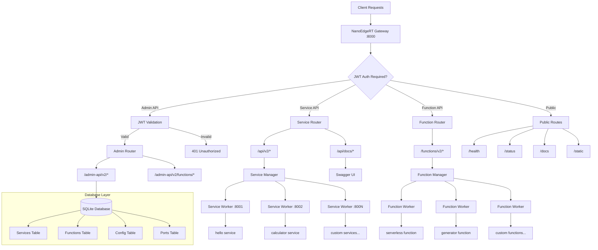

# 🚀 NanoEdgeRT v2.5

[](https://github.com/LemonHX/NanoEdgeRT/actions/workflows/ci.yml)
[](https://deno.land/)
[](https://www.typescriptlang.org/)
[](https://opensource.org/licenses/MIT)

**Next-Generation Edge Function Runtime** - A lightweight, high-performance platform built with Deno and SQLite for deploying and managing serverless functions at the edge with enterprise-grade security and developer experience.

> 🏆 **Enterprise Ready**: Sub-millisecond response times, 5,000+ ops/sec throughput, JWT authentication, versioned APIs, serverless functions, frontend hosting, and auto-generated documentation!

## ✨ Key Features

### 🔗 Versioned API Architecture

- **Service API**: `/api/v2/{serviceName}/*` - Public service endpoints
- **Function API**: `/functions/v2/{functionName}` - Serverless function execution
- **Admin API**: `/admin-api/v2/*` - JWT-protected administrative operations
- **Documentation API**: `/api/docs/{serviceName}` - Service-specific documentation

### 🛡️ Enterprise Security

- **JWT Authentication** - Industry-standard token-based authentication
- **Admin Protection** - All administrative operations require valid JWT tokens
- **Service-Level Security** - Optional JWT authentication per service
- **Database Isolation** - Secure SQLite-based service management

### ⚡ Performance & Scalability

- **Sub-millisecond** response times
- **5,000+ operations/sec** throughput
- **Isolated Workers** - Each service runs in its own Deno Worker
- **Dynamic Port Allocation** - Automatic port management system
- **Hot Reload** - Instant service updates in development

### 🎨 Developer Experience

- **Interactive API Documentation** - Swagger UI with live testing
- **Type-Safe Development** - Full TypeScript support
- **Comprehensive Testing** - 110+ tests covering all scenarios
- **Database-Driven Configuration** - No config files needed
- **Frontend Hosting** - Deploy static websites with custom server logic

### 🌐 Frontend Hosting

- **Full-Stack Deployment** - Upload JavaScript server + static assets ZIP
- **Automatic File Extraction** - ZIP files automatically extracted to static directories
- **Custom Server Logic** - JavaScript server files handle dynamic routing
- **Static Asset Serving** - Optimized static file serving with proper MIME types

### ⚡ Function Management

- **Serverless Functions** - Deploy and execute JavaScript functions on-demand
- **Generator Support** - Built-in support for streaming responses with generator functions
- **Isolated Execution** - Functions run in secure Deno Workers with configurable permissions
- **Database-Driven** - Functions stored and managed in SQLite database
- **Real-time Streaming** - Support for both regular and streaming function responses
- **Error Handling** - Comprehensive error handling and timeout protection

## 🏗️ Architecture Overview



## 🚀 Quick Start

### Prerequisites

- [Deno](https://deno.land/) v1.37 or higher

### Installation & Setup

1. **Clone the repository:**
   ```bash
   git clone https://github.com/LemonHX/NanoEdgeRT.git
   cd NanoEdgeRT
   ```

2. **Start the server:**
   ```bash
   deno task start
   ```

   The server will automatically:
   - Initialize SQLite database
   - Create default services (hello, calculator)
   - Start on port 8000

3. **Verify installation:**
   ```bash
   # Check system health
   curl http://localhost:8000/health

   # Test default service
   curl "http://localhost:8000/api/v2/hello?name=World"
   ```

4. **Access documentation:**
   - **Interactive API Docs**: http://127.0.0.1:8000/docs
   - **Service Documentation**: http://127.0.0.1:8000/api/docs/hello

## 📖 API Reference

### 🌐 Public Endpoints

| Endpoint        | Method | Description                   | Example                                   |
| --------------- | ------ | ----------------------------- | ----------------------------------------- |
| `/health`       | GET    | System health check           | `curl http://localhost:8000/health`       |
| `/status`       | GET    | Detailed system status        | `curl http://localhost:8000/status`       |
| `/docs`         | GET    | Interactive API documentation | Open in browser                           |
| `/openapi.json` | GET    | OpenAPI specification         | `curl http://localhost:8000/openapi.json` |

### 🔗 Service API (v2)

| Endpoint                          | Methods                | Description                 | Example                                             |
| --------------------------------- | ---------------------- | --------------------------- | --------------------------------------------------- |
| `/api/v2/{serviceName}/*`         | GET, POST, PUT, DELETE | Forward requests to service | `curl http://localhost:8000/api/v2/hello`           |
| `/api/docs/{serviceName}`         | GET                    | Service documentation       | `curl http://localhost:8000/api/docs/hello`         |
| `/api/docs/openapi/{serviceName}` | GET                    | Service OpenAPI schema      | `curl http://localhost:8000/api/docs/openapi/hello` |

### 🛡️ Admin API (v2) - JWT Required

All admin endpoints require JWT authentication:

```bash
# Set your JWT token
export JWT_TOKEN="your-admin-jwt-token"
```

#### Service Management

| Endpoint                        | Method | Description                 | Example                                                                                                       |
| ------------------------------- | ------ | --------------------------- | ------------------------------------------------------------------------------------------------------------- |
| `/admin-api/v2/services`        | GET    | List all services           | `curl -H "Authorization: Bearer $JWT_TOKEN" http://localhost:8000/admin-api/v2/services`                      |
| `/admin-api/v2/services`        | POST   | Create new service          | See [Service Creation](#-service-creation)                                                                    |
| `/admin-api/v2/services/{name}` | GET    | Get specific service        | `curl -H "Authorization: Bearer $JWT_TOKEN" http://localhost:8000/admin-api/v2/services/hello`                |
| `/admin-api/v2/services/{name}` | PUT    | Update service              | See [Service Updates](#-service-updates)                                                                      |
| `/admin-api/v2/services/{name}` | DELETE | Delete service              | `curl -X DELETE -H "Authorization: Bearer $JWT_TOKEN" http://localhost:8000/admin-api/v2/services/my-service` |
| `/admin-api/v2/host-frontend`   | POST   | Deploy frontend application | See [Frontend Hosting](#-frontend-hosting-deployment)                                                         |

#### Function Management

| Endpoint                         | Method | Description           | Example                                                                                                                |
| -------------------------------- | ------ | --------------------- | ---------------------------------------------------------------------------------------------------------------------- |
| `/admin-api/v2/functions`        | GET    | List all functions    | `curl -H "Authorization: Bearer $JWT_TOKEN" http://localhost:8000/admin-api/v2/functions`                              |
| `/admin-api/v2/functions`        | POST   | Create new function   | See [Function Creation](#-function-creation)                                                                           |
| `/admin-api/v2/functions/{name}` | GET    | Get specific function | `curl -H "Authorization: Bearer $JWT_TOKEN" http://localhost:8000/admin-api/v2/functions/my-function`                  |
| `/admin-api/v2/functions/{name}` | PUT    | Update function       | See [Function Updates](#-function-updates)                                                                             |
| `/admin-api/v2/functions/{name}` | DELETE | Delete function       | `curl -X DELETE -H "Authorization: Bearer $JWT_TOKEN" http://localhost:8000/admin-api/v2/functions/my-function`        |
| `/functions/v2/{name}`           | POST   | Execute function      | `curl -X POST -H "Content-Type: application/json" -d '{"key":"value"}' http://localhost:8000/functions/v2/my-function` |

#### Configuration Management

| Endpoint                     | Method | Description           | Example                                                                                          |
| ---------------------------- | ------ | --------------------- | ------------------------------------------------------------------------------------------------ |
| `/admin-api/v2/config`       | GET    | Get all configuration | `curl -H "Authorization: Bearer $JWT_TOKEN" http://localhost:8000/admin-api/v2/config`           |
| `/admin-api/v2/config/{key}` | GET    | Get config value      | `curl -H "Authorization: Bearer $JWT_TOKEN" http://localhost:8000/admin-api/v2/config/main_port` |
| `/admin-api/v2/config/{key}` | PUT    | Update config value   | See [Configuration](#-configuration)                                                             |

## 🔧 Service Management

### 🆕 Service Creation

Create a new service with the Admin API:

```bash
curl -X POST \
  -H "Authorization: Bearer $JWT_TOKEN" \
  -H "Content-Type: application/json" \
  -d '{
    "name": "my-awesome-service",
    "code": "export default async function handler(req) {\n  const url = new URL(req.url);\n  return new Response(JSON.stringify({\n    message: \"Hello from my awesome service!\",\n    method: req.method,\n    path: url.pathname,\n    timestamp: new Date().toISOString()\n  }), {\n    status: 200,\n    headers: { \"Content-Type\": \"application/json\" }\n  });\n}",
    "enabled": true,
    "jwt_check": false,
    "permissions": {
      "read": [],
      "write": [],
      "env": [],
      "run": []
    },
    "schema": "{\"openapi\":\"3.0.0\",\"info\":{\"title\":\"My Awesome Service\",\"version\":\"1.0.0\"}}"
  }' \
  http://localhost:8000/admin-api/v2/services
```

### 🔄 Service Updates

Update an existing service:

```bash
curl -X PUT \
  -H "Authorization: Bearer $JWT_TOKEN" \
  -H "Content-Type: application/json" \
  -d '{
    "enabled": false,
    "jwt_check": true
  }' \
  http://localhost:8000/admin-api/v2/services/my-awesome-service
```

### 🔒 JWT Authentication for Services

Enable JWT authentication for a service:

```bash
curl -X PUT \
  -H "Authorization: Bearer $JWT_TOKEN" \
  -H "Content-Type: application/json" \
  -d '{"jwt_check": true}' \
  http://localhost:8000/admin-api/v2/services/protected-service
```

Then access the service with JWT:

```bash
curl -H "Authorization: Bearer $JWT_TOKEN" \
     http://localhost:8000/api/v2/protected-service
```

### 📋 Service Configuration Schema

```typescript
interface ServiceConfig {
  name: string; // Unique service name
  code: string; // JavaScript/TypeScript code
  enabled: boolean; // Whether service is active
  jwt_check: boolean; // Require JWT for access
  permissions: {
    read: string[]; // File read permissions
    write: string[]; // File write permissions
    env: string[]; // Environment variables
    run: string[]; // Executable permissions
  };
  schema?: string; // OpenAPI schema (JSON string)
}
```

## ⚙️ Configuration

### 🔧 System Configuration

Update system configuration via Admin API:

```bash
# Update main port
curl -X PUT \
  -H "Authorization: Bearer $JWT_TOKEN" \
  -H "Content-Type: application/json" \
  -d '{"value": "8080"}' \
  http://localhost:8000/admin-api/v2/config/main_port

# Update JWT secret
curl -X PUT \
  -H "Authorization: Bearer $JWT_TOKEN" \
  -H "Content-Type: application/json" \
  -d '{"value": "your-super-secure-secret"}' \
  http://localhost:8000/admin-api/v2/config/jwt_secret

# Update port range
curl -X PUT \
  -H "Authorization: Bearer $JWT_TOKEN" \
  -H "Content-Type: application/json" \
  -d '{"value": "9000"}' \
  http://localhost:8000/admin-api/v2/config/available_port_start
```

### 📊 Configuration Keys

| Key                    | Type   | Description              | Default                    |
| ---------------------- | ------ | ------------------------ | -------------------------- |
| `main_port`            | number | Main server port         | 8000                       |
| `available_port_start` | number | Service port range start | 8001                       |
| `available_port_end`   | number | Service port range end   | 8999                       |
| `jwt_secret`           | string | JWT signing secret       | "default-secret-change-me" |

## ⚡ Function Management

### 🆕 Function Creation

Create serverless functions that execute on-demand with configurable permissions and isolation.

```bash
curl -X POST \
  -H "Authorization: Bearer $JWT_TOKEN" \
  -H "Content-Type: application/json" \
  -d '{
    "name": "hello-function",
    "code": "export default function(input) { return { message: `Hello, ${input.name || \"World\"}!` }; }",
    "enabled": true,
    "permissions": {
      "read": [],
      "write": [],
      "env": [],
      "run": []
    },
    "description": "Simple greeting function"
  }' \
  http://localhost:8000/admin-api/v2/functions
```

### 🔄 Function Updates

```bash
curl -X PUT \
  -H "Authorization: Bearer $JWT_TOKEN" \
  -H "Content-Type: application/json" \
  -d '{
    "code": "export default function(input) { return { message: `Updated: Hello, ${input.name}!` }; }",
    "enabled": true,
    "description": "Updated greeting function"
  }' \
  http://localhost:8000/admin-api/v2/functions/hello-function
```

### 🚀 Function Execution

Execute functions with JSON payload:

```bash
# Regular function execution
curl -X POST \
  -H "Content-Type: application/json" \
  -d '{"name": "Alice"}' \
  http://localhost:8000/functions/v2/hello-function

# Generator function with streaming response
curl -X POST \
  -H "Content-Type: application/json" \
  -d '{}' \
  http://localhost:8000/functions/v2/streaming-function
```

### 🎯 Generator Functions

Functions can be generator functions for streaming responses:

```javascript
export default function* streamingFunction() {
  yield "Starting process...";
  yield "Processing data...";
  yield "Almost done...";
  return "Completed!";
}
```

The response will be a Server-Sent Events stream:

```
data: "Starting process..."

data: "Processing data..."

data: "Almost done..."

data: [DONE]"Completed!"
```

## 🌐 Frontend Hosting Deployment

### 🚀 Deploy Frontend Applications

NanoEdgeRT v2.5 introduces powerful frontend hosting capabilities, allowing you to deploy full-stack applications with custom server logic and static assets.

#### How It Works

1. **Upload Server JS File** - JavaScript file that handles dynamic routing and server logic
2. **Upload Static Assets ZIP** - ZIP file containing your frontend assets (HTML, CSS, JS, images, etc.)
3. **Automatic Extraction** - Static files are automatically extracted to `./static/{serviceName}/`
4. **Service Creation** - A new service is created with read permissions to the static directory

#### Example Deployment

```bash
# Create a simple server.js file
cat > server.js << 'EOF'
export default async function handler(req) {
  const url = new URL(req.url);
  const staticDir = './static/my-app';
  
  let filePath = staticDir;
  if (url.pathname === "/" || url.pathname === "") {
    filePath += '/index.html';
  } else {
    filePath += url.pathname;
  }
  
  try {
    const file = await Deno.readFile(filePath);
    let contentType = "text/html";
    
    if (url.pathname.endsWith(".css")) {
      contentType = "text/css";
    } else if (url.pathname.endsWith(".js")) {
      contentType = "application/javascript";
    } else if (url.pathname.endsWith(".png")) {
      contentType = "image/png";
    }
    
    return new Response(file, {
      headers: { 'Content-Type': contentType }
    });
  } catch {
    return new Response('Not Found', { status: 404 });
  }
}
EOF

# Create a simple frontend and zip it
mkdir -p frontend/css frontend/js
cat > frontend/index.html << 'EOF'
<!DOCTYPE html>
<html>
<head>
    <title>My App</title>
    <link rel="stylesheet" href="/css/style.css">
</head>
<body>
    <h1>Welcome to My App!</h1>
    <script src="/js/app.js"></script>
</body>
</html>
EOF

cat > frontend/css/style.css << 'EOF'
body { font-family: Arial, sans-serif; margin: 40px; }
h1 { color: #333; }
EOF

cat > frontend/js/app.js << 'EOF'
console.log('App loaded!');
document.addEventListener('DOMContentLoaded', () => {
    console.log('DOM ready!');
});
EOF

# Create ZIP file
cd frontend && zip -r ../static.zip . && cd ..

# Deploy the frontend
curl -X POST \
  -H "Authorization: Bearer $JWT_TOKEN" \
  -F "server=@server.js" \
  -F "static=@static.zip" \
  -F "serviceName=my-app" \
  http://localhost:8000/admin-api/v2/host-frontend

# Your app is now available at:
# http://localhost:8000/api/v2/my-app/
```

#### Response Format

```json
{
  "message": "Frontend hosted successfully",
  "serviceName": "my-app",
  "staticPath": "./static/my-app"
}
```

#### Requirements

- **Server File**: Must be a `.js` file with a default export function
- **Static File**: Must be a `.zip` file containing your frontend assets
- **Service Name**: Must be unique and alphanumeric (hyphens allowed)

#### Use Cases

- **Single Page Applications (SPAs)** - React, Vue, Angular apps with custom routing
- **Static Websites** - Documentation sites, portfolios, landing pages
- **Progressive Web Apps (PWAs)** - Apps with offline capabilities
- **Hybrid Applications** - Mix of static content and dynamic server logic

## 🔐 Authentication & Security

### 🎫 JWT Authentication

NanoEdgeRT v2 uses JWT tokens for admin API access and optional service protection.

#### Admin JWT Token Structure

```typescript
interface JWTPayload {
  sub: string; // Subject (user ID)
  exp: number; // Expiration timestamp
  [key: string]: any; // Additional custom claims
}
```

#### Example JWT Payload

```json
{
  "sub": "admin-user",
  "exp": 1722556800,
  "iat": 1722470400,
  "role": "admin",
  "permissions": ["service:create", "service:delete", "config:update"]
}
```

### 🛡️ Security Best Practices

1. **Change Default JWT Secret**: Update the JWT secret in production
2. **Use Strong Tokens**: Generate cryptographically secure JWT tokens
3. **Set Token Expiration**: Use reasonable expiration times
4. **Service Permissions**: Grant minimal required permissions to services
5. **Network Security**: Use HTTPS in production

## 📚 Service Development

### 🖥️ Service Template

Create services using this template:

```javascript
export default async function handler(req) {
  const url = new URL(req.url);
  const method = req.method;

  // Handle different HTTP methods
  switch (method) {
    case "GET":
      return handleGet(url);
    case "POST":
      return handlePost(req);
    default:
      return new Response("Method not allowed", { status: 405 });
  }
}

async function handleGet(url) {
  const name = url.searchParams.get("name") || "World";

  return new Response(
    JSON.stringify({
      message: `Hello, ${name}!`,
      timestamp: new Date().toISOString(),
      path: url.pathname,
    }),
    {
      status: 200,
      headers: { "Content-Type": "application/json" },
    },
  );
}

async function handlePost(req) {
  const body = await req.json();

  return new Response(
    JSON.stringify({
      received: body,
      processed: true,
      timestamp: new Date().toISOString(),
    }),
    {
      status: 200,
      headers: { "Content-Type": "application/json" },
    },
  );
}
```

### 📖 OpenAPI Documentation

Add OpenAPI schema to your services for auto-generated documentation:

```json
{
  "openapi": "3.0.0",
  "info": {
    "title": "My Service",
    "version": "1.0.0",
    "description": "A sample service with OpenAPI documentation"
  },
  "paths": {
    "/": {
      "get": {
        "summary": "Get greeting",
        "parameters": [
          {
            "name": "name",
            "in": "query",
            "description": "Name to greet",
            "required": false,
            "schema": {
              "type": "string",
              "default": "World"
            }
          }
        ],
        "responses": {
          "200": {
            "description": "Successful response",
            "content": {
              "application/json": {
                "schema": {
                  "type": "object",
                  "properties": {
                    "message": { "type": "string" },
                    "timestamp": { "type": "string" }
                  }
                }
              }
            }
          }
        }
      }
    }
  }
}
```

### 🔒 Service Permissions

Configure fine-grained permissions for your services:

```typescript
{
  "permissions": {
    "read": ["/tmp", "/data"],           // File read access
    "write": ["/tmp", "/logs"],          // File write access
    "env": ["DATABASE_URL", "API_KEY"],  // Environment variables
    "run": ["curl", "git"]               // Executable commands
  }
}
```

## 🧪 Testing & Development

### 🏃 Running Tests

```bash
# Run all tests
deno task test

# Run unit tests only
deno task test:unit

# Run integration tests only
deno task test:integration

# Run with coverage
deno test --coverage=coverage --allow-all
```

### 🔧 Development Commands

```bash
# Start development server
deno task start

# Format code
deno task fmt

# Lint code
deno task lint

# Type check
deno task check

# Pre-commit checks
deno task precommit
```

### 📊 Performance Testing

Test NanoEdgeRT performance:

```bash
# Simple load test
curl -w "@curl-format.txt" -s -o /dev/null http://localhost:8000/api/v2/hello

# Benchmark with Apache Bench
ab -n 1000 -c 10 http://localhost:8000/api/v2/hello

# Concurrent requests test
for i in {1..100}; do
  curl -s http://localhost:8000/api/v2/hello &
done
wait
```

## 🚀 Deployment

### 🏭 Production Setup

1. **Compile to executable** (optional):
   ```bash
   deno compile --allow-all --output nanoedgert src/nanoedge.ts
   ```

2. **Set environment variables**:
   ```bash
   export JWT_SECRET="your-production-secret"
   export DATABASE_PATH="/var/lib/nanoedgert/database.db"
   ```

3. **Start with custom database**:
   ```bash
   deno run --allow-all src/nanoedge.ts /path/to/production.db
   ```

### 🐳 Docker Deployment

```dockerfile
FROM denoland/deno:alpine

WORKDIR /app
COPY . .
RUN deno cache src/nanoedge.ts

EXPOSE 8000
CMD ["deno", "run", "--allow-all", "src/nanoedge.ts"]
```

### ☁️ Production Configuration

```bash
# Production environment setup
curl -X PUT \
  -H "Authorization: Bearer $PROD_JWT_TOKEN" \
  -H "Content-Type: application/json" \
  -d '{"value": "production-super-secure-secret"}' \
  https://your-domain.com/admin-api/v2/config/jwt_secret

# Configure production port
curl -X PUT \
  -H "Authorization: Bearer $PROD_JWT_TOKEN" \
  -H "Content-Type: application/json" \
  -d '{"value": "80"}' \
  https://your-domain.com/admin-api/v2/config/main_port
```

## 🔧 API Client Examples

### 📱 JavaScript Client

```javascript
class NanoEdgeRTClient {
  constructor(baseUrl, jwtToken = null) {
    this.baseUrl = baseUrl;
    this.jwtToken = jwtToken;
  }

  async callService(serviceName, path = "", options = {}) {
    const url = `${this.baseUrl}/api/v2/${serviceName}${path}`;
    return fetch(url, {
      ...options,
      headers: {
        ...options.headers,
        ...(this.jwtToken ? { "Authorization": `Bearer ${this.jwtToken}` } : {}),
      },
    });
  }

  async createService(serviceConfig) {
    return fetch(`${this.baseUrl}/admin-api/v2/services`, {
      method: "POST",
      headers: {
        "Content-Type": "application/json",
        "Authorization": `Bearer ${this.jwtToken}`,
      },
      body: JSON.stringify(serviceConfig),
    });
  }

  async getServices() {
    const response = await fetch(`${this.baseUrl}/admin-api/v2/services`, {
      headers: { "Authorization": `Bearer ${this.jwtToken}` },
    });
    return response.json();
  }
}

// Usage
const client = new NanoEdgeRTClient("http://localhost:8000", "your-jwt-token");

// Call a service
const response = await client.callService("hello", "?name=Developer");
const data = await response.json();

// Create a new service
await client.createService({
  name: "api-client-service",
  code: 'export default async function handler(req) { return new Response("Hello from API!"); }',
  enabled: true,
  jwt_check: false,
  permissions: { read: [], write: [], env: [], run: [] },
});
```

### 🐍 Python Client

```python
import requests
import json

class NanoEdgeRTClient:
    def __init__(self, base_url, jwt_token=None):
        self.base_url = base_url
        self.jwt_token = jwt_token
        self.session = requests.Session()
        if jwt_token:
            self.session.headers.update({'Authorization': f'Bearer {jwt_token}'})

    def call_service(self, service_name, path='', **kwargs):
        url = f"{self.base_url}/api/v2/{service_name}{path}"
        return self.session.get(url, **kwargs)

    def create_service(self, service_config):
        url = f"{self.base_url}/admin-api/v2/services"
        return self.session.post(url, json=service_config)

    def get_services(self):
        url = f"{self.base_url}/admin-api/v2/services"
        response = self.session.get(url)
        return response.json()

# Usage
client = NanoEdgeRTClient('http://localhost:8000', 'your-jwt-token')

# Call a service
response = client.call_service('hello', '?name=Python')
print(response.json())

# Create a service
service_config = {
    'name': 'python-service',
    'code': 'export default async function handler(req) { return new Response("Hello from Python!"); }',
    'enabled': True,
    'jwt_check': False,
    'permissions': {'read': [], 'write': [], 'env': [], 'run': []}
}
client.create_service(service_config)
```

## 📈 Monitoring & Observability

### 📊 Health Monitoring

```bash
# Basic health check
curl http://localhost:8000/health

# Detailed status with metrics
curl http://localhost:8000/status | jq
```

### 📋 Service Metrics

Monitor running services:

```bash
# Get all services status
curl -H "Authorization: Bearer $JWT_TOKEN" \
     http://localhost:8000/admin-api/v2/services | jq '.services[] | {name, status, port}'

# Get specific service details
curl -H "Authorization: Bearer $JWT_TOKEN" \
     http://localhost:8000/admin-api/v2/services/hello | jq
```

### 🚨 Error Handling

NanoEdgeRT provides comprehensive error responses:

```typescript
interface ErrorResponse {
  error: string; // Error message
  message?: string; // Detailed message
  details?: string; // Additional details
}
```

Common HTTP status codes:

- `200` - Success
- `201` - Created
- `400` - Bad Request
- `401` - Unauthorized (JWT required/invalid)
- `404` - Service/Resource not found
- `500` - Internal Server Error
- `502` - Service Unavailable
- `503` - Service Failed to Start

## 🤝 Contributing

We welcome contributions! Please see our [Contributing Guide](CONTRIBUTING.md) for details.

### 🛠️ Development Setup

1. Fork the repository
2. Clone your fork: `git clone https://github.com/YOUR_USERNAME/NanoEdgeRT.git`
3. Create a feature branch: `git checkout -b my-feature`
4. Make your changes
5. Run tests: `deno task test`
6. Commit and push: `git commit -am "Add feature" && git push origin my-feature`
7. Create a Pull Request

## 📝 License

MIT License - see [LICENSE](LICENSE) file for details.

## 🙏 Acknowledgments

- **Deno Team** - For the amazing runtime
- **Hono** - For the lightweight web framework
- **Kysely** - For the type-safe SQL builder
- **Contributors** - For making NanoEdgeRT better

---

**Built with ❤️ using Deno and TypeScript**

For more information, visit our [GitHub repository](https://github.com/LemonHX/NanoEdgeRT) or check out the [documentation](https://github.com/LemonHX/NanoEdgeRT/wiki).
